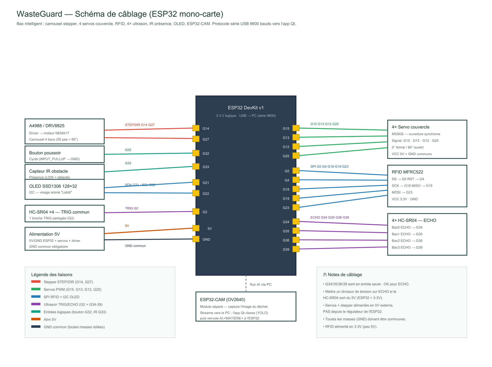
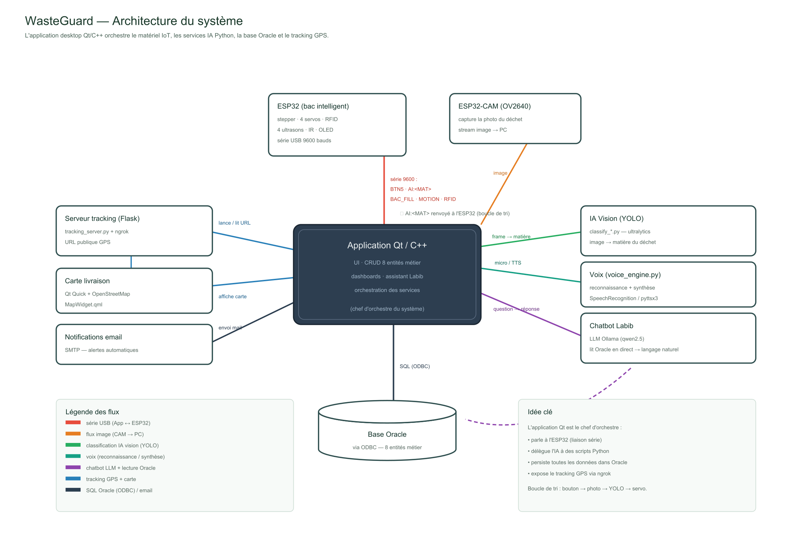

# Documentation technique — WasteGuard

| Fichier | Contenu |
|---------|---------|
| [liste-materiel.md](liste-materiel.md) | BOM : liste complète du matériel + brochage ESP32 |
| [schema-cablage.png](schema-cablage.png) | Schéma de câblage annoté (rendu image) |
| [architecture-systeme.png](architecture-systeme.png) | Schéma d'architecture (App Qt ↔ ESP32 ↔ IA ↔ Oracle ↔ tracking) |
| [architecture-systeme.svg](architecture-systeme.svg) | Source vectorielle modifiable de l'architecture |

## Schéma de câblage

> Généré à partir du brochage défini dans
> [updated_arduino_code/updated_arduino_code.ino](../updated_arduino_code/updated_arduino_code.ino).

## Architecture du système

> L'application Qt orchestre tout : série vers l'ESP32, scripts IA Python
> (vision YOLO, voix, chatbot Labib), persistance Oracle (ODBC) et tracking
> GPS via Flask + ngrok.

## À faire avant soumission (projet IoT)

- [x] Schéma de câblage présent (`schema-cablage.png`)
- [x] Schéma d'architecture présent (`architecture-systeme.png`)
- [ ] Vérifier que [liste-materiel.md](liste-materiel.md) contient les références exactes (remplacer les `?`)
- [ ] Mettre le lien de la vidéo de démo dans le [README principal](../README.md)
